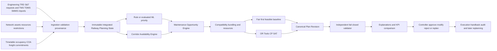
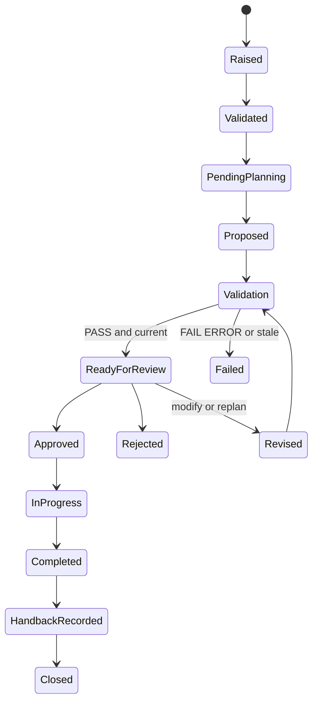
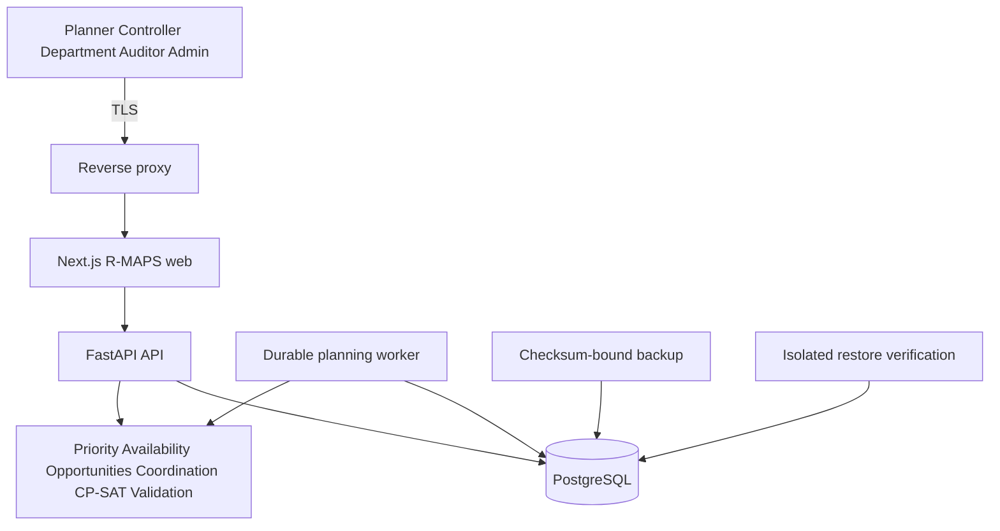

# R-MAPS Final Software Requirements Specification and Build Contract

**Railway Maintenance Allocation & Planning System**

**SIH 2026 PS26027**

**Version 2.0 — 29 September 2026**
**Implementation baseline, release status and continuation contract**

R-MAPS is a fixed-infrastructure maintenance planning decision-support prototype for Engineering, Traction Distribution and Signal and Telecommunication teams. It converts versioned maintenance demand and railway operating facts into explainable maintenance-block proposals. A human controller remains the final decision authority, and railway operating authorization remains outside the software.

This document supersedes `RailSync_AI_Solution_SRS_Build_Contract.pdf` and `RailSync_AI_SRS.pdf` for implementation and presentation. Those files remain historical references. The current product name is **R-MAPS**, expanded as **Railway Maintenance Allocation & Planning System**. “RailSync” appears only when describing a historical artifact.

## 1 Document control

| Field | Value |
| --- | --- |
| Product | R-MAPS — Railway Maintenance Allocation & Planning System |
| Problem statement | SIH 2026 PS26027 — AI-Powered Automatic Block Planning to Maximize Asset Availability for Train Operations on Indian Railways |
| System class | Human-in-the-loop railway maintenance planning decision support |
| Release status | M1–M17 complete; M18 substantially implemented with final acceptance gates open; M19 optional and not started |
| Data status | Development and demonstration data are explicitly labeled SIMULATED or IMPORTED; no live railway integration is claimed |
| Safety status | Prototype validation against configured constraints; not railway safety certification and not train control |
| Primary repository | `NVNAGATHARUN/gst-train` |
| Backend | Python 3.12, FastAPI, Pydantic, SQLAlchemy, Alembic, PostgreSQL, durable worker |
| Planning | Rule priority, corridor availability, opportunity generation, coordination, OR-Tools CP-SAT, independent validator |
| Frontend | Next.js and TypeScript with role-specific workspaces |

### 1.1 Normative language

**MUST** and **MUST NOT** define mandatory requirements. **SHOULD** defines the preferred implementation when no documented constraint prevents it. **MAY** defines an optional capability. A requirement marked implemented is backed by repository code and automated or saved evidence. A requirement marked open must not be described as completed.

### 1.2 Source precedence

1. The user-approved architecture and this version 2.0 contract govern continued implementation.
2. `CHECKLIST.md`, `docs/REQUIREMENT_TRACEABILITY.md` and `docs/evidence/` provide implementation evidence.
3. The earlier RailSync PDFs explain the original design but no longer define product naming or implementation status.
4. Domain rules supplied by an authorized railway source override synthetic fixture policy. Until then, unknown safety-critical facts remain fail-closed.

## 2 Executive summary

The planning problem is not simply “predict maintenance priority.” Railway maintenance requires access to a specific track, section or electrical zone for a specific interval, with setup, productive work and restoration time, while trains, freight uncertainty, existing possessions, restrictions, crews and machines compete for the same capacity. Engineering, TRD and S&T requests may share a coordinated possession only when their footprints, isolation requirements, work rules and resources are compatible.

R-MAPS solves this as an evidence pipeline. Departments raise versioned requirements. Import adapters normalize TMS, TDMS and SMMS-style records. Operational inputs describe the network, assets, dated train runs, train-section occupancy, COA windows, freight forecasts, restrictions, resources and existing commitments. The system freezes these facts into an immutable Integrated Railway Planning State. A rule priority engine and Corridor Availability Engine produce bounded evidence. The Maintenance Opportunity Engine generates explicit timed candidates and exclusion reasons. Coordination logic constructs compatible work bundles with concrete resources. A fair deterministic first-feasible planner and OR-Tools CP-SAT then operate on the same candidate universe. An independently implemented validator recomputes hard constraints from the frozen facts. Only a current PASS result can reach controller review.

The implemented prototype also supports weekly and monthly schedule artifacts, same-snapshot KPI comparison, rolling replanning with frozen work, isolated what-if scenarios, execution and handback evidence, audit/provenance, role-specific dashboards, and administration of network, resources and policies. The system exposes 88 HTTP operations and 15 frontend work areas in the current repository.

R-MAPS does not issue possessions, control signals, switch traction power or move trains. “Automatic block planning” means automated generation of a proposal for authorized human review.

## 3 Exact problem interpretation

### 3.1 Problem being solved

PS26027 calls for coordinated maintenance-block planning using information from Engineering, TRD and S&T maintenance systems together with timetable, corridor availability and goods-train forecasts. Work must be prioritized using criticality, urgency and asset-availability impact. Plans must coordinate departments and support weekly and monthly horizons.

R-MAPS interprets “block” as planned access to a declared railway footprint and supporting operating conditions. It keeps confirmed train paths fixed in the core model. It searches for maintenance access around those paths rather than delaying, canceling or rerouting trains. It distinguishes a line block, power block and S&T disconnection and stores each requirement explicitly.

### 3.2 What the solution must demonstrate

| PS need | R-MAPS response | Required evidence |
| --- | --- | --- |
| Integrate maintenance information | Department request workflow and idempotent TMS, TDMS and SMMS adapters | Source record, import batch, payload hash, revision and validation result |
| Integrate traffic and corridor facts | Dated train occupancy, COA windows, freight policy, restrictions and commitments | Frozen snapshot manifest and availability derivation |
| Prioritize critical work | Transparent rule score with a gated ML experiment interface | Method, version, features, timestamp and explanation |
| Coordinate departments | Compatibility, shared possession timing, isolation and resource allocation | Included requests, rejected combinations and reason codes |
| Optimize block allocation | Fixed-candidate OR-Tools CP-SAT with actual status and objective terms | Solver status, objective, bound, runtime, selected candidates and pruning |
| Protect feasibility | Independent fail-closed validation from raw snapshot facts | PASS, FAIL or ERROR report with findings |
| Support planning horizons | Weekly and monthly immutable plan artifacts | Exact assignments, deferred demand, status and reproducible exports |
| Show measurable benefit | Fair baseline and optimized plan on identical inputs | Declared KPI formula, units, denominator, signed delta and N/A handling |

### 3.3 Source confidence

The PS wording used here is cross-checked against public SIH 2026 mirrors. The organizer-issued problem statement should be archived with the final submission when available. R-MAPS engineering choices, field names and safety gates are project decisions and are not represented as official Indian Railways operating rules.

## 4 Scope assumptions and boundaries

### 4.1 In scope

- Maintenance demand for Engineering, TRD and S&T.
- Synthetic and imported source adapters with provenance and idempotency.
- Network, section, track, asset, footprint and electrical-zone models.
- Fixed passenger and freight train-section occupancy.
- COA, restrictions, existing commitments and configurable clearance policy.
- Immutable snapshots and reproducible planning runs.
- Rule priority and a versioned ML experiment interface.
- Availability, opportunity generation, compatibility, resources, baseline and CP-SAT planning.
- Independent validation, explanations, human decisions and audit events.
- Weekly and monthly schedules, replanning, what-if analysis, execution and handback records.
- Role-aware browser workspaces and container-oriented deployment packaging.

### 4.2 Out of scope

- Live interlocking, signaling, traction switching or train-control actions.
- Automatic railway authority, possession grant or safety certification.
- Certified headway, isolation or work-compatibility values that have not been supplied by an authorized source.
- National-scale deployment claims.
- Guaranteed delay reduction, reliability improvement or availability gain.
- A trained production ML model based on fabricated labels.
- Quantum computing or quantum optimization.

### 4.3 Core domain assumptions

- Operational time is stored as timezone-aware UTC and displayed in Asia/Kolkata.
- Intervals are half-open `[start, end)` after configured margins are applied.
- Track, direction, footprint and electrical coverage are explicit.
- Setup, productive work and restoration are separate intervals.
- Initial train paths are fixed in the core scheduling model.
- Work is initially non-preemptive. Interrupted work requires an explicit remaining-work assessment.
- Missing critical coverage, authority, isolation mapping or resource eligibility blocks review and approval.
- Synthetic configuration values are development fixtures and never presented as railway standards.

## 5 Research-informed design rationale

Integrated railway traffic and maintenance research shows that maintenance windows consume scarce network capacity and should be represented together with traffic in space and time. R-MAPS adopts that principle by freezing train occupancy and maintenance demand into one planning state, while deliberately keeping train paths fixed for the first operationally explainable model. Resource-oriented maintenance research motivates treating crew and equipment calendars as hard feasibility inputs. Possession-scheduling studies motivate a bounded corridor model with explicit alternatives and measurable runtime.

XGBoost and Random Forest are suitable candidates for tabular priority or risk experiments, but they do not schedule blocks. SHAP can attribute model features, but an attribution is not a causal diagnosis or safety argument. OR-Tools CP-SAT is used because the problem has discrete alternatives, optional intervals, mutual exclusion, resource capacity, precedence and weighted objectives. The validator remains separate because a solver status only proves feasibility against the encoded model; it does not independently confirm that generation and encoding were correct.

The implementation therefore protects four separations:

1. **Facts from proposals** — imported and entered facts are versioned before planning.
2. **Availability from opportunity generation** — capacity is derived before work is fitted into it.
3. **Optimization from validation** — the component proposing a plan does not certify it.
4. **Software validation from railway authority** — a PASS enables review but never grants operational permission.

## 6 Frozen logical architecture

### 6.1 Architectural invariants

- Every planning artifact MUST identify its snapshot, configuration and producer version.
- The baseline and CP-SAT branches MUST receive the same snapshot and candidate universe for fair comparison.
- The optimizer MUST NOT read mutable live facts after a run starts.
- The validator MUST read raw snapshot facts and concrete assignments, not a candidate’s cached `feasible` flag.
- Any edit MUST create a new revision and MUST trigger revalidation.
- Approval MUST atomically recheck current operational revision, validation usability and resource reservations.
- Scenario simulations MUST NOT create operational reservations or controller decisions.

## 7 AI ML optimization and validation

| Layer | Implemented method | Question answered | Prohibited interpretation |
| --- | --- | --- | --- |
| Rule intelligence | Versioned deterministic priority policy | Which requests rank higher under declared policy? | Learned failure probability |
| ML experiment | Random Forest or XGBoost interface with evaluation and versioning | Can labeled data improve a defined priority or risk target? | Automatic safe scheduling |
| Explainability | Rule contributions and optional SHAP values | Which features contributed to this score? | Causality or safety certification |
| Opportunity intelligence | Interval arithmetic and policy rules | Which request-window combinations are technically eligible? | Global schedule optimality |
| Optimization | OR-Tools CP-SAT over explicit candidates | Which compatible candidates best meet the configured objective? | Feasibility outside the generated candidate set |
| Deterministic validation | Independent recomputation from frozen facts | Does this exact proposal satisfy configured hard constraints? | Railway authorization |
| Human decision | Controller workflow | Should the validated proposal proceed in the planning process? | Permission to bypass FAIL, ERROR or stale evidence |

ML is optional at runtime. The rule baseline remains the production fallback until a model is trained on suitable labels, evaluated against a simple baseline, calibrated, versioned and approved for a specific target. An ANN is allowed only as a future forecasting experiment. No ANN belongs in the core scheduling path.

## 8 Actors roles and access

| Role | Primary purpose | Current browser workspace | Restricted actions |
| --- | --- | --- | --- |
| Department user | Raise and track owned Engineering, TRD or S&T demand and imports | Overview, Maintenance Demand, Data Readiness | Cannot plan, validate or approve |
| Planner | Prepare snapshots, opportunities, baseline and optimized proposals | Planning, Corridor, Sessions, Comparison, Validation, Schedules, Replan, Reports | Cannot grant railway authority |
| Controller | Review current evidence and record planning decisions | Planning, Corridor, Validation, Controller Review, Schedules, Replan, Execution, Reports | Cannot approve a stale, failed or scenario plan |
| Auditor | Inspect immutable evidence and provenance | Planning read views, Comparison, Validation, Review, Schedules, Execution, Reports | No operational mutation |
| Administrator | Maintain configuration and inspect system state | Data Readiness, Network and Rules, System Health, Reports | Does not receive planner/controller authority by default |

Frontend route filtering improves workflow clarity. Backend authorization remains authoritative and MUST be tested independently. Credentials and session secrets MUST NOT be stored in browser storage. The current implementation uses an HttpOnly session cookie, CSRF token, exact trusted-origin checks, role checks, credential rotation behavior and durable login throttling.

## 9 End-to-end lifecycle

Maintenance-request state and plan-revision state MUST remain separate. A request may appear in several simulations without changing its operational lifecycle. An approved plan does not mean work was completed. Completion requires immutable execution evidence and guarded handback/restoration records.

### 9.1 New request behavior

A newly submitted maintenance request enters the live request register. It MUST NOT silently mutate an existing immutable planning snapshot. A planner reviews incoming demand, prepares a new snapshot with declared horizon and source coverage, then reruns priority, capacity, opportunities, baseline, CP-SAT and validation. The planning screen distinguishes live intake from the selected historical snapshot.

## 10 Maintenance demand and ingestion

### 10.1 Maintenance request

A request records department, asset or footprint, issue type, severity, urgency, asset criticality, estimated duration, earliest start, deadline policy, line-block requirement, power-block requirement, S&T disconnection, setup/restoration needs, required skills/equipment and supporting evidence. Revisions are append-only. Department ownership is enforced.

### 10.2 Import contract

TMS, TDMS and SMMS adapters accept explicit JSON or CSV mappings. Each source record stores source system, external identifier, source revision, event time, receipt time, schema version, payload hash and import batch. Import is previewed before commit. Invalid rows are quarantined with row-level errors. Duplicate source revisions are idempotent; out-of-order or conflicting updates remain visible for review.

CSV/JSON mappings are project interfaces, not claims about undisclosed production railway APIs. Every demonstration import is labeled SIMULATED or IMPORTED.

## 11 Network assets traffic and operating facts

The network model includes stations, sections, tracks, directions, electrical zones, assets and links. A work footprint may cover multiple entities. A train run is dated and decomposed into section occupancy. Cross-midnight services use explicit service dates and day offsets. COA windows carry revision, coverage, semantics and validity. Freight forecasts declare uncertainty policy and coverage. Restrictions and existing blocks identify their footprint and interval.

The system MUST NOT infer that a whole section is free because one track is free. It MUST NOT treat the existence of some occupancy rows as proof of complete timetable coverage. Source readiness records coverage and freshness separately from row counts.

## 12 Integrated Railway Planning State

A `PlanningSnapshot` is the immutable boundary for a planning case. It includes:

- horizon and timezone;
- selected network and asset revisions;
- eligible maintenance request revisions;
- dated train runs and occupancies;
- COA and freight inputs;
- restrictions and existing commitments;
- resource units and calendars;
- compatibility, priority, clearance and objective configuration;
- execution/freeze context for replanning;
- source versions, schema versions and content hashes;
- declared missing, stale or unauthenticated facts.

Snapshot creation MUST be transactional. Its content hash MUST be reproducible. Planning artifacts reference the hash, not only the snapshot identifier. A change to a relevant source creates a new snapshot or invalidates affected work; it never rewrites history.

## 13 Priority and risk engine

The rule engine computes a bounded priority from declared fields such as severity, urgency, overdue duration, asset criticality, traffic exposure, mandatory deadline and readiness. Its output includes the formula revision and component contributions. Missing mandatory facts block scoring or produce an explicit fallback state.

The ML experiment interface may train Random Forest or XGBoost only on a defined label with train/validation/test separation. Promotion requires a data dictionary, leakage review, class-balance report, baseline comparison, calibration where applicable, stability checks, model hash and version, evaluation metrics, documented failure modes and SHAP attribution. Synthetic labels MAY test the pipeline but MUST NOT support predictive claims.

## 14 Corridor Availability Engine

For each explicit footprint and track, the engine begins with declared COA or permitted planning envelopes and subtracts confirmed occupancy, configured headway and clearance, restrictions, existing possessions, electrical constraints, frozen work and the declared freight-uncertainty policy. The result is a set of half-open capacity intervals with evidence showing their source boundaries.

Unknown critical coverage produces unavailable or blocked capacity, not an optimistic gap. Boundary tests cover overlap, adjacency, midnight, multiple tracks, electrical zones, missing COA, stale facts and freight uncertainty. Priority cannot create capacity.

## 15 Maintenance Opportunity Engine

The opportunity engine matches a request to calculated capacity. Each candidate contains:

- request and request-revision identifiers;
- snapshot and capacity-window identifiers;
- section, track, direction and electrical footprint;
- setup, work and restoration subintervals;
- concrete isolation and resource requirements;
- readiness, deadline and precedence evidence;
- inclusion or exclusion reasons;
- generation policy and candidate hash.

Candidate generation uses conservative rounding. A request that cannot fit returns structured exclusions such as insufficient duration, outside horizon, missing isolation coverage, resource unavailable, dependency unsatisfied, policy unknown or stale source. An empty candidate set is a valid visible result.

## 16 Compatibility bundling and resources

Compatibility is data-driven. Department pairs are not inherently compatible. A bundle is allowed only when footprints, timing, work methods, electrical isolation, S&T disconnection, setup/restoration, precedence and resources agree under a versioned policy.

Named resource units carry capabilities and calendars. Candidate assignments bind concrete units where required. Shared setup or restoration benefit is calculated from actual candidate structure. Unknown compatibility excludes the bundle. Capacity and resource conflicts are hard constraints.

## 17 Baseline planner

The baseline is deterministic and first-feasible. It uses the same snapshot, eligible requests, candidates, hard constraints and resource facts as CP-SAT. It orders work by a declared stable policy and accepts the first feasible alternative. It is not intentionally degraded and does not omit constraints to make R-MAPS look better.

The baseline produces the same canonical `PlanRevision` and passes through the same validator and KPI engine. If it cannot cover mandatory work, the result is infeasible with reasons.

## 18 CP-SAT scheduling model

### 18.1 Decision variables

For each generated candidate (c), define a Boolean variable (x_c) that is one when the candidate is selected. Candidate data already contain fixed setup, work and restoration intervals and concrete resource assignments. Optional interval variables MAY be used where needed for capacity constraints, but the implemented first model selects from a finite generated set.

### 18.2 Hard constraints

- **At most once:** for each request (r), `sum(x_c for c covering r) <= 1`.
- **Mandatory coverage:** mandatory requests with eligible candidates MUST meet configured coverage or the model reports infeasible.
- **Candidate incompatibility:** overlapping track, electrical, possession, work-method or commitment conflicts cannot both be selected.
- **Resource capacity:** selected candidates cannot exceed unit or pool capacity in any overlapping interval.
- **Precedence:** a successor cannot be selected unless its predecessor condition is satisfied.
- **Frozen work:** approved/frozen assignments are preserved exactly during rolling replanning.
- **Horizon and footprint:** every selected interval stays inside its candidate window and declared physical coverage.

### 18.3 Configurable weighted objective

The objective uses integer-scaled terms. Typical terms reward mandatory and high-priority coverage and compatible bundling, while penalizing deferral, possession count, track minutes, freight exposure, fragmentation and change from frozen or approved work. Each term and weight is stored with the run. Objective weights MUST NOT relax hard constraints.

### 18.4 Solver evidence

The run records actual status (`OPTIMAL`, `FEASIBLE`, `INFEASIBLE`, `UNKNOWN` or error), objective value, best bound, optimality gap where defined, runtime, branches, conflicts, candidate count, pruning and configuration. “Optimal” is qualified as optimal only within the generated candidate set. A timeout MUST NOT fabricate a solution.

## 19 Independent fail-closed validator

The validator is implemented separately from candidate generation and CP-SAT. It reconstructs every assignment from saved intervals and rechecks:

- snapshot and plan hashes;
- train occupancy and clearance;
- line-block, power-block and S&T requirements;
- track, section and electrical-zone conflicts;
- setup/work/restoration duration and containment;
- resource capabilities, calendars and capacity;
- compatibility and bundle consistency;
- mandatory coverage, deadlines and precedence;
- frozen work and approved commitments;
- source coverage, freshness and authority;
- scenario and operational-revision boundaries.

Outcomes are PASS, FAIL or ERROR. FAIL, ERROR, stale data, mismatched hashes and unknown critical facts block controller approval. Mutation tests deliberately corrupt otherwise valid proposals to prove the validator detects train overlap, resource conflict, isolation mismatch, timing corruption and stale evidence.

## 20 Explanation and controller decision

Explanations are built from structured facts. They show why a request was selected or deferred, why a bundle was accepted or rejected, which capacity boundaries applied, which resource was assigned, which objective terms changed and which constraints were binding. Template explanations are preferred to a language model for core evidence.

The controller review packet includes exact snapshot and plan hashes, included and deferred work, train/capacity context, resource and access requirements, validation status and expiry, solver metadata, comparison context and explanation evidence. A controller may approve, reject, request replanning or create a modified child revision. Every decision requires a reason and is audited. Modification invalidates the previous PASS until the child is revalidated.

Approval is a planning-system decision. The UI and exports MUST continue to state that external railway authorization is required.

## 21 Weekly monthly and KPI evaluation

Weekly and monthly schedules are immutable projections of canonical assignments. They preserve exact setup, work and restoration intervals, resources, department, status, validation context and deferred demand. JSON and CSV exports are hash-bound and reproducible.

The KPI engine compares the baseline and CP-SAT plan only when snapshot, requirements, candidates, configuration and evaluation method match. Metrics include requests scheduled, mandatory coverage, possession count, track minutes, block utilization, bundling, resource utilization, freight forecast exposure and runtime. Every value has units, formula and denominator. Signed negative changes remain visible. A percentage is N/A when its denominator is zero. Forecast exposure is not measured delay, planned availability is not actual asset reliability, and planned work is not completed work.

## 22 Replanning what-if execution and handback

Rolling replanning starts from a new source event such as train delay, freight change, resource outage, urgent defect or restriction change. The system records event occurrence and receipt times, invalidates affected artifacts, captures current approval, execution, freeze and reservation state, creates a new snapshot, preserves exact frozen work, reruns both planners, validates the replacement and requires a new controller decision.

What-if scenarios deep-copy a source snapshot and apply typed overlays. They run the real priority-to-validator pipeline but remain isolated. They cannot approve work, reserve resources or alter operational source records. Impact views compare source and scenario facts and MUST NOT call different-input changes optimizer gains.

Execution records are immutable observations tied to the approved plan and assignment hash. Interrupted work requires versioned remaining-work assessment. Shared-possession release requires terminal evidence for all members and explicit restoration attestations. Software reservation release records observed workflow state only; it is not a railway handback authority.

## 23 Data model

| Domain | Principal persisted entities |
| --- | --- |
| Identity and audit | User, BrowserSession, LoginThrottle, AuditEvent, WorkerHeartbeat |
| Maintenance | MaintenanceRequest, RequestRevision, ImportBatch, SourceRecord |
| Network and operations | NetworkEntity, NetworkRevision, NetworkLink, Train, TrainRun, TrainOccupancy, CoaWindow, FreightForecast |
| Planning state | PlanningSnapshot, SnapshotItem, PlanningRun, PlanningSession, OperationalState |
| Intelligence | PriorityAssessment, ModelExperiment, AvailabilityComputation, OpportunityComputation |
| Coordination | ResourceUnit, CoordinationRevision, CoordinationComputation, WorkerLease |
| Plan and governance | PlanRevision, ValidationReport, DecisionExplanation, ControllerDecision, PlanReservation |
| Delivery and evaluation | PlanningSchedule, PlanComparison |
| Replanning and scenario | DisruptionEvent, SnapshotInvalidation, ReplanningBatch, EventReconciliation, ReplanningCapture, WhatIfScenario, WhatIfImpact |
| Execution | FreezePolicy, ExecutionRecord, WorkReconciliation, PossessionRelease |

All mutable business concepts use append-only revision or immutable artifact patterns where practical. Foreign keys and unique source/revision keys preserve lineage. Hashes bind payloads used by later approvals and exports. Database migrations are versioned through Alembic; the current implementation reaches migration 026.

## 24 API contract

The FastAPI service exposes versioned `/api/v1` operations. The current OpenAPI surface contains 88 operations. Endpoint groups cover:

- health, readiness, sessions and current user;
- maintenance requests, revisions and imports;
- network, assets, resources and policy revisions;
- trains, occupancy, COA and freight inputs;
- snapshots, workspace projections and planning sessions;
- priority, availability, opportunities and coordination;
- baseline, CP-SAT, plan revisions and validation;
- explanations, controller decisions and reservations;
- weekly/monthly schedules, comparisons and exports;
- disruptions, rolling replans, what-if scenarios and impacts;
- execution, freeze, reconciliation, restoration and release;
- reports, audit, provenance and system administration.

Writes use authentication, backend role authorization, CSRF protection for cookie sessions, idempotency keys where retries are likely, expected-revision checks for concurrency and field-level validation. Errors preserve unknown, infeasible, stale and unauthorized states. APIs MUST NOT return a fake success artifact after a worker failure or timeout.

## 25 Frontend requirements and implemented screens

The UI is an operational planning desk rather than a generic dashboard. Its signature view is a time-track timeline that distinguishes train occupancy, freight uncertainty, COA, restrictions, available capacity, department demand, candidate blocks, selected integrated blocks, validation conflicts and frozen work.

| Work area | User question answered |
| --- | --- |
| Overview | What case is selected and what currently needs attention? |
| Maintenance Demand | What work is required, where, by when and with which prerequisites? |
| Planning Workspace | Which demand fits which capacity and what is the proposed integrated block? |
| Corridor and COA | Why does capacity exist or remain unavailable? |
| Planning Sessions | Which real pipeline stages and solver results exist? |
| Baseline Comparison | What changed on the same facts and how are KPIs calculated? |
| Independent Validation | Which configured constraint passed or failed, with what evidence? |
| Controller Review | What exact proposal is under human decision? |
| Weekly and Monthly Plan | What validated or tentative work is arranged across the horizon? |
| Replan and What-if | How do new facts or isolated scenarios change the plan? |
| Execution and Handback | What work was observed and what restoration evidence exists? |
| Reports and Audit | Which saved artifact, decision and source produced this result? |
| Data Readiness | Are imports, coverage, freshness and authority sufficient? |
| Network and Rules | Which network, resources and policies are currently configured? |
| System Health | Are API, database, migrations, worker and queues ready? |

Every screen handles loading, empty, stale, partial, infeasible, failure and API-error states. No frontend fallback value may be presented as computed output. Demonstration fixtures are labeled SIMULATED.

## 26 Security auditability and privacy

- Password-like prototype credentials are stored as hashes; browser session secrets are hashed in PostgreSQL.
- Cookies are HttpOnly and SameSite strict. Production requires secure cookies and HTTPS.
- Browser writes require an exact configured Origin and a valid CSRF token. Missing, wildcard, suffix-matching and cross-site origins are rejected.
- Backend role checks protect every sensitive operation; UI route restrictions are supplementary.
- Login failures are durably rate-limited and secrets are not echoed.
- Audit events record actor, action, target, timestamp, request context and outcome without storing credentials.
- Raw imported payloads require restricted access and retention policy.
- Logs and exports MUST avoid session secrets, credentials and unnecessary personal data.
- Approval, reservation and release use transactions and optimistic concurrency checks.

## 27 Deployment and recovery

The repository contains pinned, non-root backend and Next.js container images; PostgreSQL, migration, API, worker and web Compose services; internal service networking; health ordering; a worker heartbeat; checksum-bound backups; and an isolated non-empty-target-safe restore workflow. Production requires an HTTPS reverse proxy, exact secure browser origins, protected secrets, persistent database storage and monitored worker health.

Docker was not available on the development host during the recorded gate. Static and automated deployment tests pass, but live container build, HTTPS session, backup and restore acceptance remain open. The contract therefore does not claim production deployment completion.

## 28 Verification strategy

### 28.1 Automated layers

- Unit tests for interval arithmetic, policy rules and scoring.
- PostgreSQL integration tests for migrations, constraints, concurrency, idempotency and transactions.
- Small exhaustive checks for baseline/CP-SAT candidate selection.
- Mutation tests for independent validation.
- API tests for authentication, roles, CSRF, stale hashes and retry behavior.
- Frontend TypeScript, lint, component/presentation checks and real-backend browser harnesses.
- Benchmark scenarios for 20, 100 and 300 generated requests with declared limits.
- Compatibility-on/off demonstration proving that a bundle disappears when policy changes.

### 28.2 Evidence rule

Milestone N+1 MUST NOT begin until milestone N has passing automated tests and correct backend output checked against explicit expected results. Each milestone keeps commands, source revision, results, persisted examples and limitations under `docs/evidence/`. Unrun tests are never described as passing.

### 28.3 Current verified status

The current full backend suite passes **215 tests** after restoring strict exact-origin and CSRF behavior. Separate frontend type checking and linting are part of the final repository gate. Browser evidence includes five hero screens at desktop/mobile widths, a 720 CSS-pixel reflow proxy, role-specific navigation and direct-route denial. These captures use SIMULATED data and do not establish operational fitness.

## 29 Nonfunctional requirements

| ID | Requirement |
| --- | --- |
| NFR-01 Safety boundary | The system must state that railway authority remains external and fail closed on unknown critical facts. |
| NFR-02 Reproducibility | A saved snapshot and versioned configuration must reproduce the candidate and evaluation inputs. |
| NFR-03 Integrity | Hashes, revisions and transactions must prevent silent stale approval or partial reservation. |
| NFR-04 Explainability | Every score, exclusion, assignment, validation finding and KPI must identify its evidence and method. |
| NFR-05 Performance | Bounded demonstration instances must complete within declared solver budgets and expose timeout/UNKNOWN honestly. |
| NFR-06 Accessibility | Keyboard navigation, focus visibility, semantic labels, responsive layouts and 200 percent reflow must be reviewed. |
| NFR-07 Availability | API/database readiness and worker heartbeat must be visible; degraded states must not appear healthy. |
| NFR-08 Security | Exact-origin, CSRF, session, role, rate-limit and secure-cookie controls must pass automated tests. |
| NFR-09 Maintainability | Modules use typed contracts, migrations, locked dependencies and a modular monolith plus worker architecture. |
| NFR-10 Auditability | Source, plan, validation, decision, execution and export artifacts must remain traceable and immutable. |

## 30 Risks and mitigations

| Risk | Effect | Mitigation |
| --- | --- | --- |
| Unauthenticated railway rules | Unsafe or misleading feasibility | Keep facts explicitly synthetic/imported and fail closed until authority is recorded |
| Incomplete timetable or COA coverage | False free capacity | Coverage declarations, freshness checks and unavailable state |
| Candidate pruning removes a better plan | Qualified optimality only | Record pruning, compare bounds, enlarge generation in controlled tests |
| ML label leakage or synthetic labels | False prediction claims | Gated experiment interface and rule fallback |
| Objective hides trade-offs | Misleading “best” plan | Store weights and term breakdown; show signed KPIs |
| Baseline engineered to lose | Invalid evaluation | Same inputs, same constraints and deterministic honest policy |
| Stale approval | Decision on obsolete facts | Hash/revision recheck and automatic invalidation |
| UI fabricates or caches old results | Loss of trust | Real API artifacts, explicit empty/stale states and saved-case identity |
| Worker interruption | Missing or partial artifacts | Durable jobs, leases, status and late-publication fencing |
| Demo mistaken for live control | Safety and credibility risk | Persistent SIMULATED labels and authority disclaimer |

## 31 Implementation status and remaining work

### 31.1 Completed milestone gates

- **M1–M6 P0:** repository, database, requests/imports, network/assets, traffic/COA/freight, immutable snapshots and fair baseline.
- **M7–M12 P1:** rule priority and ML experiment boundary, availability, opportunities, coordination/resources, genuine CP-SAT and independent validator.
- **M13–M15 P2:** explanations/controller/audit, weekly/monthly schedules and fair KPI comparison.
- **M16–M17 P3:** rolling replanning with frozen work and isolated what-if scenarios.

### 31.2 M18 substantially implemented

The global shell, role workspaces and all 15 work areas are implemented. H1 Planning, H2 Corridor, Optimization State, H3 Comparison, H4 Validation and H5 Controller Review are connected to backend artifacts. Weekly/monthly planning, replanning/what-if, execution/handback, reports/audit, data readiness, network/rules and system health are implemented. Deployment packaging and repeatable benchmarks exist. Desktop, mobile, reflow and five-role browser captures exist for selected SIMULATED cases.

### 31.3 Release gates still open

1. Complete the current-date A–B–C–D judge walkthrough from request intake through snapshot, baseline, CP-SAT, validation, comparison, controller decision, execution/replan and saved evidence.
2. Complete and inspect fresh-load API failure and recovery captures.
3. Complete supporting-screen keyboard, native 200 percent zoom and final visual acceptance.
4. Confirm a current-data controller approval demonstration with fresh validation.
5. Run a successful production Next.js build on a host that permits its child process.
6. Build and run the container stack on a Docker-capable host with HTTPS, backup and isolated restore verification.
7. Reconcile all remaining checklist and traceability entries with the final evidence commit.

M18 MUST remain open until these gates pass. M19 MUST NOT begin before M18 closes.

### 31.4 Optional M19

Forecasting experiments may begin only when suitable historical data and a defined prediction target exist. Candidate models must beat a simple seasonal or persistence baseline on held-out data. Forecasts remain inputs to planning uncertainty; they do not replace CP-SAT or validation.

## 32 Acceptance criteria

### 32.1 Core functional acceptance

- A department user can create and revise an owned request and import a labeled source batch.
- A planner can create an immutable snapshot with visible coverage and freshness.
- Availability derives windows from saved occupancy, COA, freight, restrictions and margins.
- Opportunities contain complete timed phases and exclusion evidence.
- Compatibility policy enables a valid ENG/TRD bundle and disables it in a controlled variant.
- Baseline and CP-SAT use identical saved inputs and return actual statuses.
- Deliberate plan corruption produces validator FAIL or ERROR.
- A controller cannot approve a failed, stale, mismatched or scenario plan.
- Weekly/monthly schedules and KPI exports reproduce saved assignments.
- A disruption creates a new snapshot and preserves frozen work.
- A what-if scenario leaves operational reservations unchanged.
- Execution and release require exact current evidence.

### 32.2 Presentation acceptance

- A railway planner can understand why a block fits without a developer explaining the algorithm.
- Facts, forecasts, recommendations, validation and human decisions are visually distinct.
- The UI shows why a candidate was rejected and why validation failed.
- The same-snapshot baseline comparison shows formulas, denominators and negative or N/A results honestly.
- Every displayed operational result originates from a backend artifact.
- SIMULATED data and the external-authority boundary remain visible.

## 33 Numbered implementation roadmap

| Milestone | Priority | Status | Dependency and gate |
| --- | --- | --- | --- |
| M1 Repository database migrations auth tests | P0 | Complete | Foundation |
| M2 Maintenance requests revisions imports | P0 | Complete | M1 |
| M3 Network assets footprints isolation restrictions | P0 | Complete | M2 |
| M4 Timetable occupancy COA freight | P0 | Complete | M3 |
| M5 Immutable planning snapshots | P0 | Complete | M4 |
| M6 Fair first-feasible baseline | P0 | Complete | M5 |
| M7 Rule priority and ML experiment boundary | P1 | Complete | M6 |
| M8 Corridor Availability Engine | P1 | Complete | M7 |
| M9 Maintenance Opportunity Engine | P1 | Complete | M8 |
| M10 Compatibility bundling and resources | P1 | Complete | M9 |
| M11 OR-Tools CP-SAT | P1 | Complete | M10 |
| M12 Independent fail-closed validator | P1 | Complete | M11 |
| M13 Explanations controller decisions audit | P2 | Complete | M12 |
| M14 Weekly and monthly planning | P2 | Complete | M13 |
| M15 Fair KPI evaluation | P2 | Complete | M14 |
| M16 Rolling replanning frozen work execution | P3 | Complete | M15 |
| M17 Isolated what-if scenarios | P3 | Complete | M16 |
| M18 Frontend deployment benchmark judge demo | P3 | In progress | M17; open gates in section 31.3 |
| M19 Forecast experiments | P3 optional | Not started | M18 complete plus suitable evaluated data |

## 34 Codex Build Contract and Master Continuation Prompt

You are continuing **R-MAPS — Railway Maintenance Allocation & Planning System**, the SIH 2026 PS26027 fixed-infrastructure maintenance planning decision-support prototype. Treat `docs/R-MAPS_FINAL_SRS_BUILD_CONTRACT.md` as the implementation baseline and `CHECKLIST.md`, `docs/REQUIREMENT_TRACEABILITY.md` and `docs/evidence/` as the evidence ledger.

Preserve this exact architecture: Engineering/TRD/S&T maintenance demand and labeled TMS/TDMS/SMMS imports plus network/assets/resources/restrictions plus timetable/dated occupancy/COA/freight/commitments → immutable Integrated Railway Planning State → rule or evaluated ML priority and Corridor Availability Engine → Maintenance Opportunity Engine → compatibility/bundling/resource allocation → fair first-feasible baseline and OR-Tools CP-SAT → canonical plan revision → independently implemented fail-closed validator → structured explanations and same-snapshot KPI comparison → controller approve/modify/reject/replan → execution/handback/audit → later replanning.

Do not redesign the high-level architecture. Do not add quantum. Do not introduce microservices, Kafka, Spark or Kubernetes without a measured need. Use the existing modular FastAPI/Pydantic/PostgreSQL/Alembic backend, durable worker, OR-Tools CP-SAT and Next.js/TypeScript frontend.

Continue only at M18. First read the open gates in section 31.3 and the latest evidence. Complete the current-date integrated A–B–C–D judge walkthrough, failure/recovery capture, remaining accessibility and visual review, production build on a permissive host, and live Docker deployment/recovery acceptance. Update the checklist and traceability only after each check has actual evidence. Do not start M19 until M18 has passing automated tests, correct backend output, reviewed browser evidence and deployment/recovery evidence.

Never fabricate optimizer output, conflicts, priority scores, validation status or KPI improvement. Synthetic fixtures are permitted only when visibly labeled and processed by the real backend. Keep unknown, empty, infeasible, stale, timeout and error states visible. Never force a positive comparison. Never make the baseline artificially poor.

Use explicit footprints, half-open timezone-aware intervals and separate setup/work/restoration. Confirmed occupancy and configured clearance, possession, electrical, resource, precedence, mandatory deadline and frozen-work requirements are hard. ML and objective weights cannot override them. The first train times remain fixed.

Return actual solver status, objective terms, best bound and runtime. Qualify optimality to the generated candidate set. Validate independently from raw snapshot facts. FAIL, ERROR, stale evidence and mismatched hashes block approval. Controller edits create new revisions and require revalidation. Scenario plans never create operational reservations.

Compute KPIs only from saved intervals with declared units, formulas and denominators. Compare identical snapshots and requirements. Show signed negative changes and N/A percentages. Distinguish planned availability from measured reliability, forecast exposure from measured delay, and planned work from completed work.

At each completed gate, report what changed, the commands run, the observed result, saved backend/browser evidence, limitations and the exact next task. Preserve unrelated user work. Commit only reviewed source and documentation. Never commit `.env`, database files, credentials, logs or QA scratch output.

## 35 References

1. SIH 2026 community archive, PS SIH26027, public mirror: https://sih2026.vuce.in/ps/SIH26027
2. Smart India Hackathon official problem-statement portal, authority to archive when available: https://sih.gov.in/sih2026PS
3. Tomas Lidén and Martin Joborn, “An optimization model for integrated planning of railway traffic and network maintenance,” Transportation Research Part C 74, 2017, 327–347. https://doi.org/10.1016/j.trc.2016.11.016
4. “Resource considerations for integrated planning of railway traffic and maintenance windows,” 2018. https://rune.une.edu.au/entities/publication/ee4602db-f694-41d0-9d52-2f3412e862c6
5. “Development of a maintenance possession scheduler for a railway,” South African Journal of Industrial Engineering 34(2), 2023. https://doi.org/10.7166/34-2-2750
6. “A heuristic approach to integrate train timetabling, platforming, and railway network maintenance scheduling decisions,” Transportation Research Part B 158, 2022. https://doi.org/10.1016/j.trb.2022.02.002
7. Tianqi Chen and Carlos Guestrin, “XGBoost: A Scalable Tree Boosting System,” 2016. https://arxiv.org/abs/1603.02754
8. Scott M. Lundberg and Su-In Lee, “A Unified Approach to Interpreting Model Predictions,” 2017. https://arxiv.org/abs/1705.07874
9. Google OR-Tools CP-SAT and scheduling documentation. https://developers.google.com/optimization/cp and https://github.com/google/or-tools/blob/stable/ortools/sat/docs/scheduling.md
10. FastAPI documentation. https://fastapi.tiangolo.com/
11. PostgreSQL range-type documentation. https://www.postgresql.org/docs/current/rangetypes.html
12. Next.js documentation. https://nextjs.org/docs
13. Pydantic documentation. https://docs.pydantic.dev/latest/

Research sources motivate the architecture. They do not establish R-MAPS performance, railway approval or field safety. Project results are limited to the declared simulated scenarios and saved evaluation evidence.
